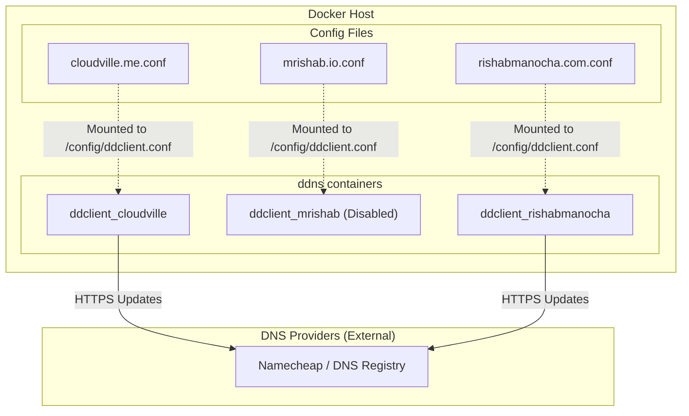

# Anton Dynamic DNS Client

This application manages Dynamic DNS configurations for multiple domains using Docker containers. It allows a home server to maintain up-to-date DNS records that point to its public IP address, even when that address changes.

## Overview Flowchart



## Setup Instructions

### Environment Configuration

1. Copy the template environment file to create your own configuration:
   ```sh
   cp template.env .env
   ```

2. Edit the `.env` file with your specific values:
   ```env
   DDNS_PUID=1000  # User ID for the container
   DDNS_PGID=1000  # Group ID for the container
   HOST_TZ=America/Los_Angeles  # Your local timezone
   ```

### DDNS Configuration Files

1. Create the configuration directory:
   ```sh
   mkdir -p static/config
   ```

2. Edit configuration files inside `static/config/` for each domain (e.g., `cloudville.me.conf` and `rishabmanocha.com.conf`) with your DNS provider details:
   ```ini
   use=web, web=dynamicdns.park-your-domain.com/getip
   protocol=namecheap
   server=dynamicdns.park-your-domain.com
   login=yourdomain.com
   password=your-namecheap-ddns-password
   *, @
   ```

## Docker Compose Configuration

The application uses Docker Compose to run separate DDNS client containers:

1. **ddclient_cloudville**: Updates DNS records for `cloudville.me` using `static/config/cloudville.me.conf`.
2. **ddclient_mrishab**: Updates DNS records for `mrishab.io` (currently disabled with compose profiles).
3. **ddclient_rishabmanocha**: Updates DNS records for `rishabmanocha.com` using `static/config/rishabmanocha.com.conf`.

Each container:
- Uses the `ghcr.io/linuxserver/ddclient` image.
- Is configured with run-as user and group identity from the `.env` file (`DDNS_PUID`/`DDNS_PGID`).
- Is set to restart automatically unless stopped manually.