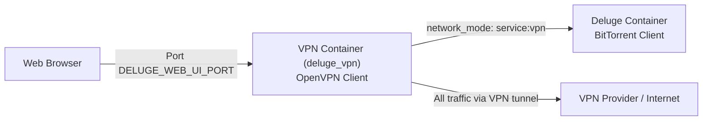

# Deluge (with VPN)

Deluge is a lightweight, free BitTorrent client. This deployment runs Deluge behind an OpenVPN container, so all torrent traffic is routed through a VPN tunnel.

## Architecture



## Setup Instructions

### Prerequisites
- Docker and Docker Compose installed on your system
- A valid OpenVPN config file at `./services/deluge_vpn/vpn/vpn.conf`
- Download directory accessible to the container

### Quick Start
1. Configure your environment variables in the `.env` file
2. Run the application:
```sh
docker-compose up -d
```

### Environment Variables
- `DELUGE_WEB_UI_PORT`: Host port for accessing the Deluge web interface (default: `8112`)
- `DELUGE_CONFIG_MOUNT_DIR`: Path to store Deluge configuration (mounted to `/config`)
- `DOWNLOADS_MOUNT_DIR`: Path to store downloaded files (mounted to `/downloads`)
- `DELUGE_LOGLEVEL`: Log verbosity for Deluge
- `REMOTE_USERNAME` / `REMOTE_PASSWORD`: OpenVPN authentication credentials
- `APP_PUID` / `APP_PGID`: User/group identity for the Deluge process
- `HOST_TZ`: Timezone setting

## Usage
- Access the web interface at `http://your-server-ip:DELUGE_WEB_UI_PORT`
- Default web UI password is `deluge`
- Configure your preferences and download locations
- All download traffic automatically routes through the VPN

## Troubleshooting
- If connections to trackers fail, verify your VPN config at `./services/deluge_vpn/vpn/vpn.conf`
- Permission issues with the downloads directory can be fixed by setting appropriate `APP_PUID`/`APP_PGID` values
- Performance problems might require adjusting queue settings and connection limits in the Deluge web UI

## Further Resources
- [Official Deluge Documentation](https://dev.deluge-torrent.org/wiki/UserGuide)
- [Return to Main Documentation](../README.md)
