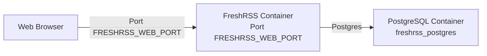

# FreshRSS

FreshRSS is a self-hosted RSS feed aggregator. This Docker setup provides a lightweight, responsive, and customizable feed reader backed by a PostgreSQL database.

## Architecture



## Setup Instructions

### Prerequisites
- Docker and Docker Compose installed on your system

### Quick Start
1. Configure your environment variables in the `.env` file
2. Run the application:
```sh
docker compose up -d
```

### Environment Variables

**Global:**
- `APP_PUID` / `APP_PGID`: Run-as user/group identity
- `HOST_TZ`: Timezone (e.g. `UTC`)

**FreshRSS:**
- `FRESHRSS_WEB_PORT`: Host port for the web interface (default: `4523`; container port is always `80`)
- `FRESHRSS_MOUNT_DIR`: Persistent config/data directory (mounted to `/config`)

**PostgreSQL (super user):**
- `PG_USERNAME` / `PG_PASSWORD` / `PG_DATABASE`: Postgres superuser credentials
- `PG_MOUNT_DIR`: Postgres data directory on host

**PostgreSQL (FreshRSS database):**
- `FRESHRSS_DB_USER` / `FRESHRSS_DB_PASS` / `FRESHRSS_DB_NAME`: Credentials for the FreshRSS-specific database (created by `db-init-scripts/`)

## Usage
- Access the web interface at `http://your-server-ip:FRESHRSS_WEB_PORT`
- Complete the initial setup with your preferred settings
- Add your RSS/Atom feeds and organize them into categories
- Access your feeds from any device or use compatible mobile apps

## Troubleshooting
- Database connection issues might require checking the postgres container is healthy before FreshRSS starts
- Feed update problems could be related to cron job settings inside the container
- For slow performance, consider optimizing your database

## Further Resources
- [Official FreshRSS Documentation](https://freshrss.github.io/FreshRSS/en/)
- [Return to Main Documentation](../README.md)
