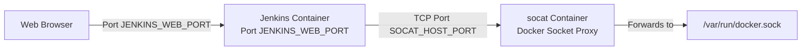

# Jenkins CI/CD Server

Jenkins is an open-source automation server. This deployment runs Jenkins alongside a `socat` container that exposes the Docker socket over TCP, allowing Jenkins pipelines to run Docker commands without a bind mount.

## Architecture



## Configuration

### Environment Variables

Copy the template.env to .env:

```sh
cp template.env .env
```

Edit the .env file with your configuration:

```
JENKINS_WEB_PORT=8888             # Host port for Jenkins web UI (container port 8080)
JENKINS_SLAVE_PORT=50000          # Host port for Jenkins agent connections (JNLP)
JENKINS_TIMEZOME=America/Vancouver # Timezone passed to JVM via -Duser.timezone
JENKINS_MOUNT_DIR=/mnt/external_hdd/jenkins  # Persistent Jenkins home directory

SOCAT_HOST_DOCKER_SOCK=/var/run/docker.sock  # Docker socket on the host
SOCAT_HOST_PORT=10023             # TCP port socat listens on to forward Docker API calls
```

> [!NOTE]
> There is a known typo in the env var: `JENKINS_TIMEZOME` (missing the 'n'). This matches the variable name used in `docker-compose.yml`.

## Usage

### Starting the Application

```sh
docker-compose up -d
```

### Accessing the Interface

Access Jenkins at:
```
http://your-server-ip:JENKINS_WEB_PORT
```

Or via reverse proxy at `https://jenkins.cloudville.me`.

### Initial Setup

1. Get the initial admin password:
   ```sh
   docker exec jenkins cat /var/jenkins_home/secrets/initialAdminPassword
   ```
2. Complete the setup wizard and install recommended plugins
3. Create admin credentials
4. Configure the Docker cloud using `tcp://jenkins_socat:2375` as the Docker host

## Troubleshooting

### Common Issues

- **Jenkins fails to start**: Check logs with `docker logs jenkins`
- **Docker API not reachable from pipelines**: Ensure the `socat` container is running and accessible at `jenkins_socat:2375`
- **Plugin installation fails**: Check network connectivity and proxy settings

### Logs

```sh
docker logs jenkins
docker logs jenkins_socat
```

## Additional Resources

- [Official Jenkins Documentation](https://www.jenkins.io/doc/)
- [Jenkins Docker Image](https://hub.docker.com/r/jenkins/jenkins)
- [Back to Main Repository](..)
