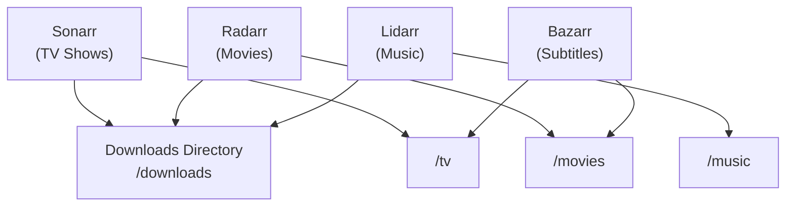

# Media Server (*Arr Stack)

This directory contains the media automation stack: **Sonarr**, **Radarr**, **Lidarr**, and **Bazarr**. These apps automate finding, downloading, and organizing TV shows, movies, music, and subtitles.

## Architecture



## Services & Ports

| Service | Port (Host) | Container Port | Purpose |
|---------|------------|----------------|---------|
| Sonarr  | `SONARR_WEB_UI_PORT` (default: `8989`) | `8989` | TV show monitoring & auto-download |
| Radarr  | `RADARR_WEB_UI_PORT` (default: `7878`) | `7878` | Movie monitoring & auto-download |
| Lidarr  | `LIDARR_WEB_UI_PORT` (default: `8686`) | `8686` | Music monitoring & auto-download |
| Bazarr  | `BAZARR_WEB_UI_PORT` (default: `6767`) | `6767` | Subtitle syncing for movies & TV |

## Environment Variables

- `APP_PUID` / `APP_PGID`: Run-as user/group identity for all containers
- `HOST_TZ`: Timezone (e.g. `America/Vancouver`)
- `DOWNLOADS_MOUNT_DIR`: Shared download directory (mounted to `/downloads` in each *arr)
- `MEDIA_TV_MOUNT_DIR`: TV show library path (mounted to `/tv` in Sonarr/Bazarr)
- `MEDIA_MOVIES_MOUNT_DIR`: Movie library path (mounted to `/movies` in Radarr/Bazarr)
- `MEDIA_MUSIC_MOUNT_DIR`: Music library path (mounted to `/music` in Lidarr)
- `SONARR_CONFIG_MOUNT_DIR`: Sonarr config directory
- `RADARR_CONFIG_MOUNT_DIR`: Radarr config directory
- `LIDARR_CONFIG_MOUNT_DIR`: Lidarr config directory
- `BAZARR_CONFIG_MOUNT_DIR`: Bazarr config directory

## Setup Instructions

1. Configure your environment variables:
   ```sh
   cp template.env .env
   ```
2. Run the stack:
   ```sh
   docker compose up -d
   ```

## Further Resources
- [Sonarr Documentation](https://wiki.servarr.com/sonarr)
- [Radarr Documentation](https://wiki.servarr.com/radarr)
- [Lidarr Documentation](https://wiki.servarr.com/lidarr)
- [Bazarr Documentation](https://wiki.bazarr.media/)
- [Return to Main Documentation](../README.md)
