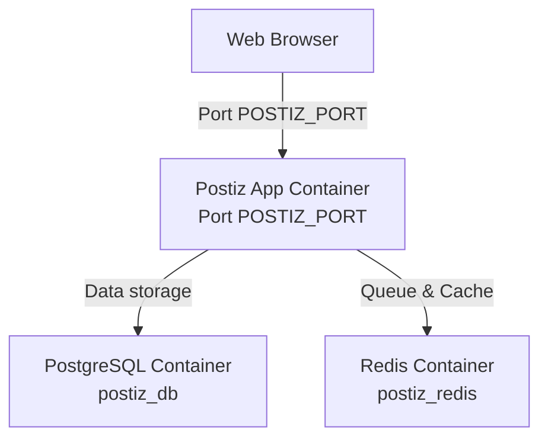

# Postiz

Postiz is a self-hosted social media scheduling and management tool. It allows you to plan, create, and schedule posts across various social media platforms from a unified interface.

## Architecture



## Setup Instructions

### Prerequisites
- Docker and Docker Compose installed on your system
- A domain name for the application (required for some social media API integrations)

### Quick Start
1. Configure your environment variables in the `.env` file
2. Run the application:
```sh
docker-compose up -d
```

### Environment Variables

**App Configuration:**
- `POSTIZ_PORT`: Host port for the web interface (default: `5000`)
- `POSTIZ_PUBLIC_DOMAIN`: The public domain where Postiz is hosted
- `JWT_SECRET`: Secret key for session encryption
- `POSTIZ_CONFIG_MOUNT_DIR`: App configuration mount directory
- `POSTIZ_UPLOAD_MOUNT_DIR`: App media uploads mount directory

**PostgreSQL (super user):**
- `PG_USERNAME` / `PG_PASSWORD` / `PG_DATABASE`: Postgres superuser credentials
- `PG_MOUNT_DIR`: Postgres data directory on host

**PostgreSQL (Postiz database):**
- `POSTIZ_USER` / `POSTIZ_PASSWORD` / `POSTIZ_DB`: Credentials for the Postiz-specific database

**Redis:**
- `POSTIZ_REDIS_DATA_MOUNT_DIR`: Redis data directory on host

## Usage
- Access the web interface at `http://your-server-ip:POSTIZ_PORT` or via your reverse proxy
- Register an admin account on first run
- Connect your social media accounts (Twitter, LinkedIn, Facebook, etc.)
- Start scheduling your social media posts

## Troubleshooting
- Database connection issues might require checking database container logs
- If social media logins fail, verify your `POSTIZ_PUBLIC_DOMAIN` and the OAuth callback URLs configured in the respective social platform developer portals
- Check the application logs with `docker logs postiz_app` for detailed error information

## Further Resources
- [Postiz GitHub Repository](https://github.com/gitroomhq/postiz-app)
- [Return to Main Documentation](../README.md)
